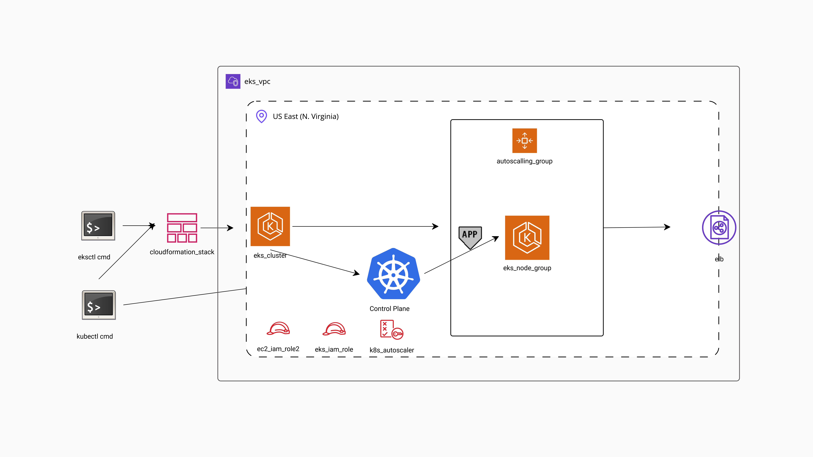

<h2 align="center"><u>EKS eksctl</u></h2>


<h4 align="center"> EKS eksctl </h4>

<p align="center">
<br>
</p>

### [+] Description
This project demonstrates setting up an EKS cluster with eksctl utility.


##### Steps to Create EKS Cluster:
---
+ Clone this  repo: `https://github.com/omarsamyi/Eks_eksctl`
+ Edit `eks_deployment.yaml`
   - e.g. `cluster name, nodegroup name, etc`.
+ CMD: `eksctl create cluster -f eks_deployment.yaml`
+ CMD: `kubectl apply -f nginx-deployment.yaml`
+ CMD: `kubectl apply -f nginx-service.yaml`


---
**Run as dry-run: ** 
``` eksctl create cluster \
--name demo-cluster \
--version 1.29 \
--region us-east-1 \
--nodegroup-name demo-nodes \
--node-type t2.micro \
--nodes 2 \
--nodes-min 1 \
--nodes-max 3 \
--dry-run >> eks_deployment.yaml 
```
**eksctl get-started** -> <https://eksctl.io/getting-started>

### [+] Find me on 
<a href="https://m.me/https://www.linkedin.com/in/omarsamyi/" target="_blank"></a>


